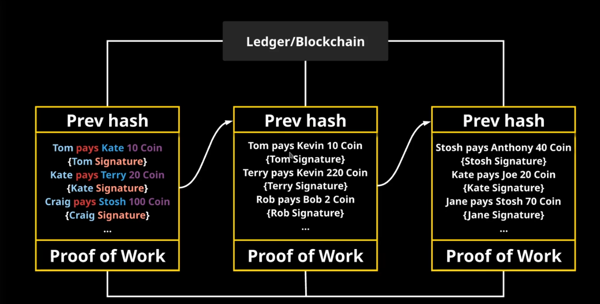
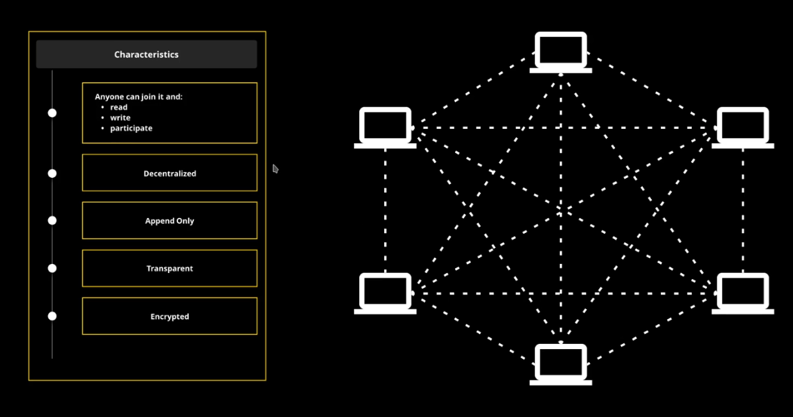

# Introduction

`
Blockchain is a decentralized mechanism that establishes a consensus for past and current transactions, divided onto blocks. It represents a data structure.
`

## Four Characteristics
- **decentralized:** no central point of control - depends on 51% of the network 
- **transparent:** anyone has the ability to see all of the transactions
- **immutable:** not mutable unless a single entity controls 51% or more of the network
- **encrypted:** relies on cryptographic standards and algorithms to sign and very transactions and blocks

## Where is it used?
- **What are the applications of a database?**
  - banking system
  - like a database, has many applications... cannot really answer
- Ethereum: implement smaller pieces of code into the blockchain
  - Smart contracts: a piece of code with cryptocurrency inside it
    - many applications
  
## Ledger/Blockchain
### Distributed Ledger

- each block is tied to the previous block in the chain
  - each block has the hash of the previous block (in the header)
    - this determines order of the blocks
  - payload contains the block data (transactions/events)
    - transactions/events
    - signatures
  - consensus mechanism (proof of work)

## Types of Blockchains
### Public Blockchains

- bitcoin
  - proof of work
  - anyone can:
    - read
    - write
    - participate
  - decentralized
  - append only
  - transparent
  - encrypted
  - anonymous
### Private Blockchian
- invite only/permission-based participation

  

