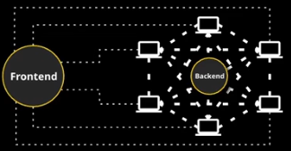
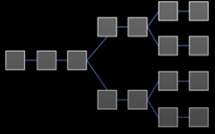
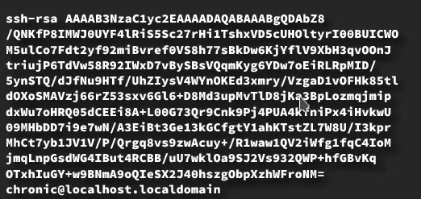
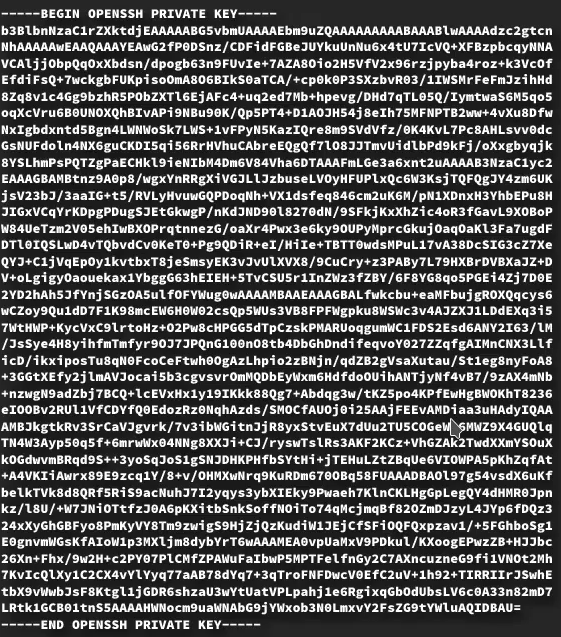

# Terminology

## Addresses
- composed of 26-35 alphanumeric characters
- denotes senders and receivers
- requires public key and private key (created in pairs)
- use sha256sum on the public key to create the adddress
    ```
    ssh-keygen 
    sha256sum forBlockchain.pub
    ```

## Transactions
- some sort of transfer of value from one address to another
- an event that can be anything
  
  **Transaction Fees**: fee collected for performing a function to perform a function on the event. Collected by staker or miner.

## Turing Complete
- any system of data manipulation that can simulate a Turing machine

## Block Explorer
- web tool used for viewing information about addresses, transactions, transaction histories, and individual blocks in a blockchain

## Block Height
- the number of blocks that are ahead of the given block in a blockchain (already processed/history)
- every block contains a header containing the current block height

## Block Reward
- rewards for the miners which solve some type of mining puzzle
- halves itself every 4 years
- merkle root: 
  - hash of the transaction that happened

## Central Ledger
- case when there is a centralized ledger where there is a main ledger that contains all information in one place

## P2P
- no centralized server between nodes to communicate between each other

## Smart Contracts
- like a regular contract
  - can put anything you want into it
  - contract auto executes based on conditions
  - parties remain anonymous 
  - if not executed, value is returned (or ultimately goes to else which cannot be changed; immutable)
  - transparent
  - does not require a third party
  
## Consensus
- type of agreement that means that multiple parties have agreed on the same value or goal
- in blockchain, it means that nodes have agreed on the same STATE

## Confirmation
- happens after successful process of a transaction
- cannot be reversed
- the details of the transaction/trade has been agreed upon and are finalized to become part of the blockchain
- multiple confirmations are often needed
  
## Cryptocurrency
- like digital money
- uses high-end encryption techniques to create funds and verify their transfer
- cannot exist without blockchain
- uses decentralized control system which works through DLT

## Cryptographic Hash Function
- mathematical function that has certain characteristics (not having these characteristics make them impractical for cryptography):
  - computationally efficient
  - deterministic - A=B where B is always the result of A
  - collision resistant 
  - pre-image resistant: you cannot determine the input from the output
  

## DAPP

- decentralize dapplication
- backend runs on multiple computers part of a decentralized network
- subject to latency depending on location

## Distributed Ledger
- series of identical databases that every participant has
- often confused with blockchain

## Distributed Network
- network that expands across several networks
- can function as a single unit, or separately as individual units

## Difficulty
- see anatomy of a block
- proof of work: how hard it is to guess the hash
  - how many characters in a hash
  
## Digital Signature
- used to identify an entity which is sending a message
- every document contains a digital signature
- used for non repudiation (you cannot say "I didn't do this" if your signature is on it) because they are authentic, non-forgeable, and non-reusable

## Double Spending
- an attempt to duplicate a transaction
- blockchain prevents double spending by using timestamps on transactions and then by broadcasting them to the nodes that are in the network

## Ethereum
- is a protocol, a programming language (solidity), a blockchain, a platform
- no limited scripting unlike other blockchains
- uses smart contract technology
- average block size of 2KB (smaller than cryptocurrency)

## EVM (Ethereum Virtual Machine)
- is a network of machines that run the same software and are public nodes


## Soliity
- high level programming language that is based on contracts
- used to implement smart contracts


## Testnet
- dev environment for blockchain

## Fork

- update to the blockchain (blockchains cannot go backwards)
- a change at a particular block where certain things are done different from previous blocks
  - e.g. changes in the protocol
### Soft Fork (backward compatible)
- older software using old protocol can still add blocks to the blockchain (as long as they meet requirements of protocols)
### Hard Fork (non-backward compatible)
- older software using old protocol can no longer add blocks to the blockchain

## Genesis Block
- the first block in the blockchain

## Hash
- values returned by the hash function
- no matter how many digits are typed into the hash function, output will always be X digits
  - has a defined fixed output length
- even if two input values differe by only one character, their output values will be extremely different

## Hash Rate
- number of hashes that can be generated per unit of time
- speed of ocmputing the hashes per second
- intiially done by CPUs, later replaced by ASICs (GPUs)

## Mining
- mining is the process of inserting a transaction into a blockchain's ledger where all previous transactions are also recorded
- ensures security and is a method of achieving blockchain decentralization

## Wallets
- store, receives, and send
- manipulates cryptocurrency
- holds essential infromation related to users' cryptocurrency

## Public Keys

- random numbers that are generated for a user, and can be viewed by anyone
  
- every private key has an associated public key
  
## CPU Mining
- no longer profitable (inefficient)
- do a lot of complex stuff really fast

## GPU Mining
- mcuh more suitable than CPU mining (although getting phased out)
- do a lot of simple stuff really fast

## Nodes
- parts of the network
- can carry out different functions (transaction validation, mining, other tasks) depending on the blockchain

## ASIC Application Specific Integrated Circuit
- created specifically for some specific intent instead of being built for general use
- can function significantly faster than typical CPUs and GPUs but cannot be used like a general CPU or GPU; serves one purpose
- if protocol changes, they are useless

## Ledger
  - digital record of all transactions than an organization has performed


  


