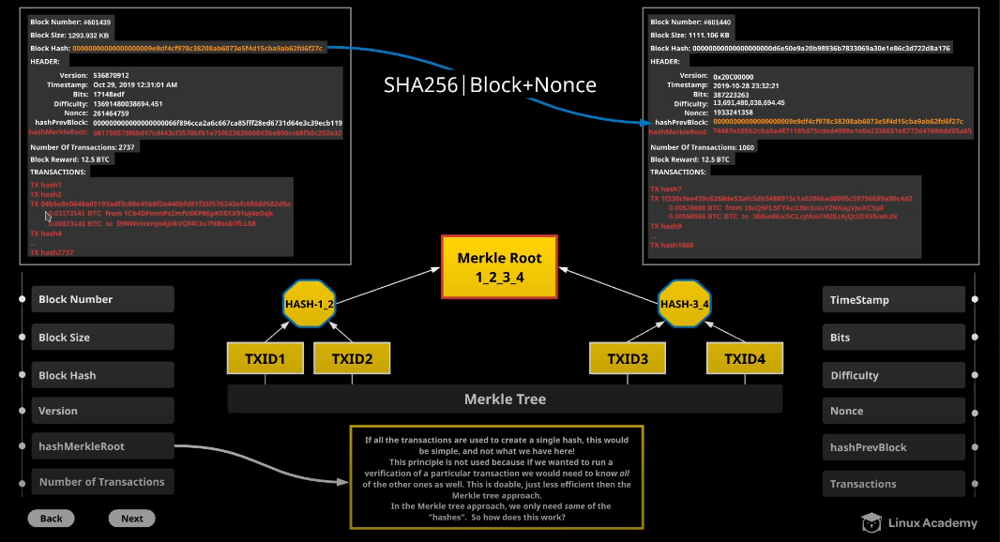

# Blockchain Architecture

**Block Number:** number of blocks in the blockchain line

**Block Size:** size of transactions aggregated

**Block Hash:** hash header of the block (e.g. sha256)

**Version:** version of the protocol needed to process the block

**hashMerkelRoot:** methodology used to create a has
- aggregate tree of multiple transactions
- can be written in different notations (hex vs decimal)

**Number of transactions:** each block contains a number of transactions; not defined; number of transactions varies per block

**Timestamp:** point in time when the hashing of a block took place

**Transaction:** individual payment (or can be an event depending on protocol/blockchain e.g. bitcoin)

**hashPrevBlock:** pointer to the previous block
- think of a linked list

**Block + Nonce:** 
- number of zeroes beginning the hash


**Difficulty** how hard to guess the hash (genesis block = 1)
  - can increase and decrease 
    - dependent on whether it goes over expected mining time or below it (D=expected/actual;D=>1?increase(a,b):decrease(a,b))
  - newDiff = oldDiff * (expected/actual)
    - ran every X amount of time (e.g. 2 weeks)
    - constnatly readjusted to make it not too easy and not too hard
    - dependent on total hashing power of the network (# of nodes and their processing power, point in time, etc)
    - can have a HardLimit (always be increasing difficulty)
  - **bits**: compact representation of the target difficulty (max target;target difficulty)
    - hash of the block must be less than bits value 
    - Nonce + data from block must produce valuie less than bits
    - 
 **example**

 target = targetMax/D
 targetMax = 1d00ffff
 D = 13,691,480,038,694.45
 = 0x000000000000000000148edf0000000000000000000000000
  -  needs to be 32byte number represented as a decimal number
  0x17 14 8e df
  0x17 = 23 decimal
23 - 3 (bytes) = 20
20 pairs of zeroes needed to be appended
-> 9  zeroes need to be prepended because it needs to be 32 bytes
  148edf
9 bytes [148edf] 20 bytes
actual difficult must be less this value
- block hash < target difficulty
- 

**Proof of Work Example**
- determining how to get target difficulty
- target = 0148edf
  
```python
#!/bin/python3.7
import hashlib
sampleData = "TX 04b5e8e0648a05193adf3c08e45b8f2e440bfd81f35f576243efc0fddd582d9a 0.01173141 BTC from 1Cb4DFmmPzZmfVdKP86pKE8XX91uJ4eDqk 0.00873141 BTC to 39NWvivxnyo6jnkVQf4Ct u7NBsob7fLL58"
Bits = 0x1d00ffff

# HEX 0x1d   DEC 29
# HEX 00ffff DEC 65535
p1 = 23
p2 = 0x148edf
#TARGET: t = 00ffff * 2**(8*(0x1d-3))
#Bits = 0x17148edf
#target = 0148edf * 2**(8*(0x17 - 3))
num1 = p1 - 3
num2 = num1 * 8
num3 = 2**num2
target = 2**num2
targetHex = format(target,"016x").zfill(64)
####
nonce = 0 
while 1:
    testHash = hashlib.sha256(sampleData.encode() + str(nonce).encode()).hexdigest()
    if testHash < targetHex:
        print(str(nonce)+ " " + testHash + " " + targetHex + " FOUND!!!\n")
        break
    else:
        print(str(nonce)+ " " + testHash + " " + targetHex + "\n")
        nonce+=1

```

```python
#!/bin/python3.7
import hashlib
sampleData = "TX 04b5e8e0648a05193adf3c08e45b8f2e440bfd81f35f576243efc0fddd582d9a 0.01173141 BTC    from 1Cb4DFmmPzZmfVdKP86pKE8XX91uJ4eDqk 0.00873141 BTC  to  39NWvivxnyo6jnkVQf4Ctu7NBsob7fLL58"
Bits = 0x1d00ffff

# HEX 0x1d   DEC 29
# HEX 00ffff DEC 65535
p1 = 30
p2 = 0x148edf
#TARGET: t = 00ffff * 2**(8*(0x1d-3))
#Bits = 0x17148edf
#target = 0148edf * 2**(8*(0x17 - 3))
num1 = p1 - 3
num2 = num1 * 8
num3 = 2**num2
target = 2**num2
targetHex = format(target,"016x").zfill(64)
####
nonce = 0 
while 1:
    testHash = hashlib.sha256(sampleData.encode() + str(nonce).encode()).hexdigest()
    if testHash < targetHex:
        print(str(nonce)+ " " + testHash + " " + targetHex + " FOUND!!!\n")
        break
    else:
        print(str(nonce)+ " " + testHash + " " + targetHex + "\n")
        nonce+=1
        
```


