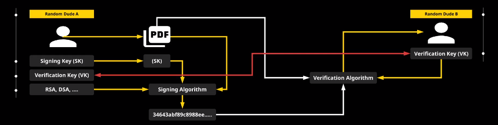

# Digital Signatures


**Requirements**
- no repudiation (signed by sender)
- wants to keep it secret


**Signature concepts:**
- Signing Key (SK): like a signature/identity
- Verification Key (VK): tied to the signing key; used to decrypt message; has a mathematic relationship to the signing key; cannot determine SK from VK; 
- output of the signing algorithm after inputting SK
- only valid for the data it was used for 
  - signature cannot be maintained if data is changed (becomes invalidated)
- Verification Algorithm uses VK to verify sender
- if Verification Algorithm fails, the document can be thrown away as damaged/corrupt
- far safer than physical signature
- no relationship between signature and data
- can be used by both humans and machines
  
## Implementation of Digital Signature


- suggested you use an existing library, not implement yourself
  - tested

1) select prime number q (useful if it is very large)
2) select prime number p
3) p-1 must be divisible by 1: mod((p-1)/q)==0
```
e.g.
P is 2048 bits long
Q is 224 bits long
```


- L = alpha = (g^((p-1/q)mod p ))!=1
- g:{2...p-2}; g is arbtrirary as long as it meets the condition
- L = pow(g,((p-1)//q),p)


- random intenger from 1 =< d = < q-1
- d = private key
- B = (L^d mod p)
- public key = (p,q,L,B)

**Signing a file**
- Ephermal key: use once per signing (not generated, something just selected)
- 0 < Ke < q
- Ke = q - rand(0,INT_MAX)
- first part of the signature:
  - r = (l^Ke mod p ) mod q != 0 

- second part of the signature:
  - S = ((SHA(m)+d*r)Ke^-1) mod q != 0

**Verification of the Signature (S)**
Digital signature = (r,S)
- public key gives us values for p, q, L, B
```python
#m=hash
invSq = modinv(S,q)
u1 = (invSq*m)%q
u2 = (invSq*r)%q
v = ((pow(L,u1,P)*pow(B,u2,p))%p)%q
```


