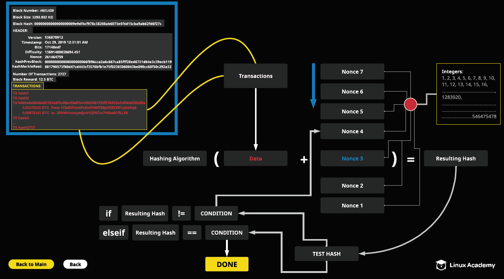
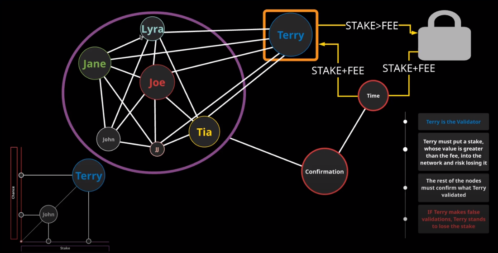
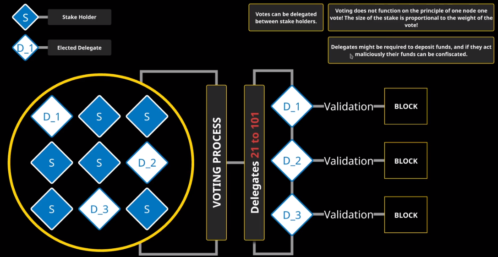
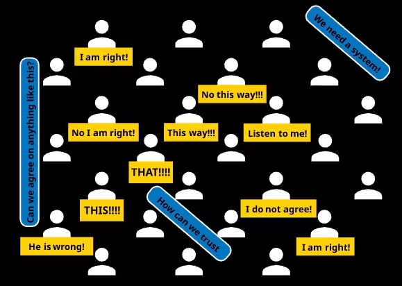
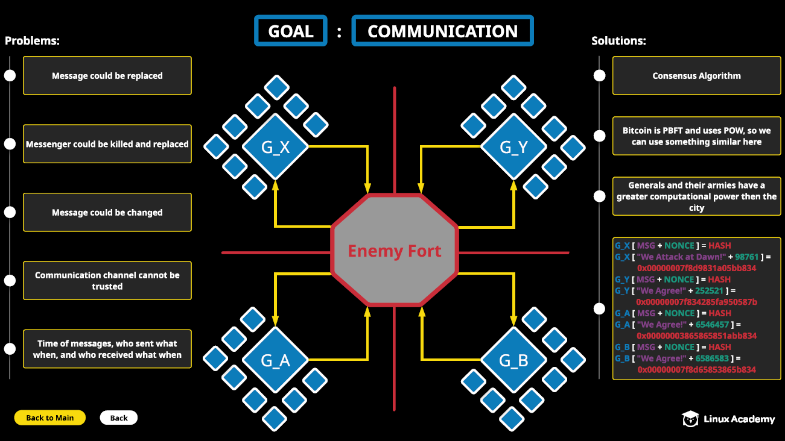

# Introduction
- most are just theoretical
  - only some are implemented
    - proof of work
    - proof of stake

## Proof of work
```
- demands some form of work from users
    e.g. expenditure of computer power
- based on the the principle that a certain amount of computational power needs to be expended before suggesting a value to be entered into the blockchain; blocks are entered after an amount of work is done
- very common in cryptocurrencies e.g. bitcoin
- difficult to validate, easy to perform
```

### Pros:
- scalability
- the bigger the community, the more secure

### Cons:
- a lot of processing power is required
- quite expensive
- mining becomes harder over time: more processing power is needed
- vulnerable to 51% attack

**Goal** is to produce a hash smaller than the target value (in this example)


- header is taken
- header is serialized
  - data stream is created
  - adapted to the needs to the hashing algorithm
  - transactions are embedded
  - merkel tree is constructed out of transactions
- take resulting hash and run it through a test
- check if condition is met
  - if not, try a different nonce
- if met, done

```python
#17 14 8e df
int("0x17",16)
# = 23
# 23 - 3 = 20
# max difficulty
#000000000000000000148edf0000000000000000000000000000000000000000
block_hash = "00000000000000000009e9df4cf978c38208ab6073e5f4d15cba9ab62fd6f27c"
target = "000000000000000000148edf0000000000000000000000000000000000000000"
#block_hash < target
int(block_hash,16) < int(target,16)
#True
```

## Proof of Stake
```
- made in opposite of Proof of Work
- when a new block needs to be created, a PoS system chooses the new person for validation and mining by checking how many coins the person has
- more coins = more mining power
- PoS vs PoW: Most stake vs Most power
- PoS miners are called validators(nodes)
- when a transaction starts, it gets placed in a block and duplicated across all validators
- every node has to solve a computational problem (the proof of work problem/mining)
- after succeeding in solving the problem, the miner will get the reward
- after verification is complete, the transaction is added to the blockchain
- protocol favours the ones with the most stake
- stake needs to be greater than the transaction fee for the transaction it is validating for
    - malicious actions causes him to lose this stake
    - validator is confirmed by other nodes (validator is likely the largest stake, confirmations are smaller stakes)
    - if valid, staker gets fee(cannot be greater than stake)+their stake back
```


**Pros:**
- does not require large amounts of computing power
- a PoS miner is always limimted to only mining the percentage of a transaction that is equal to its stake
- considered a safe network; less vulnerable to 51% attack (hard to have 51% of the supply)

**Cons**
- nothing at stake problem: failure to reach consensus with the nodes; cannot agree on the history of the blockchain
- fake stack attack: uses a very small amount of stake or even nothing in order to crash a node
  - overflow a node with a large amount of data; denial of service to individual nodes

## Delegated Proof of Stake (DPoS)
```
- DPoS is considered to be more democratic than PoS
- coin holders vote for delegates /witnesses in an election process
    - witnesses validate transactions and are rewarded coins for validating
    - stakeholders get the amount of votes equivalent to their stake
    - witnesses follow a reputation system
        - must produce blocks timely
        - must not act maliciously
- examples: BitShares, Steen, EOS
- can delegate votes between themselves (transfer votes to other stakeholders)
```
**Pros**
- more scalable than PoW and PoS (more txs/s)
- lower requirements for eletricity
- promotes decentralization, although votes are weighted
- delegates are motivated to be honest
- delegates can validate transactions in seconds (very fast)
- malicious delegates can be voted out in seconds (real-time voting)

**Cons**
- complete decentralization is not achievable (more delegates = slower network)
- more susceptible to 51% attack
- people with more tokens are likely to be chosen as delegates and they will become richer
- if too many delegates (usual limit of 100), excess will become backup delegates and will have to wait for thei turn
- smaller stakeholders are not as important as larger stakeholders


- Dn is elected by stakeholders: vote weight = proportionate to their stake
- delegates might be required to deposit funds (lost when malicious)
- delegates can transfer weight of vote to others
  
## Proof of Burn
```
- destroys cryptocurrency in a verifiable way
- bitcoin/altcoin: destroy a certain number of bitcoins relative to the number of altcoins that need to be claimed
- by destroying bitcoins, that value gets converted to some other cryptocurrency
- can be considered as a type of mining where the value is given to new coins by destroying other coins that have value
- has the following properties:
    - undependeability
    - uncensorability
    - binding
- mining chance to be chosen: depending on how much miner has burned
- can be used to peg one currency to another 
```
**burn address:** nothing can be spent from this address, never to be recovered

**Pro:**
- not a lot of computation poewr
  
**Cons:**
- can run out of cryptocurrencies to burn


## Practical Byzantine Fault-Tolerant Mechanism 
### Generalization of Consensus Mechanisms

- the events and problems that lead to the idea of blockchain (1982)
- Problem: a number of generals is each leading their own part of the Byzantine army
  - important that the generals can agree whether or not to attack and when
    - many problems arise when trying to achieve this communication
- 1999: Solution of problem was generated - PBFT algorithm
- PBFT is the property of a system that is resilient to failurse and enables the system to function properly to attain adequate consensus, despite the existence of nodes that are malicious or fail to communicate with the other nodes
  - aims to secure systems from failing and lower the influence of malicious nodes
- we agree on something (the dollar has value)
- peer-to-peer problem



- immune to lack of trust: trustless system
- the nonce must produce a hash with a certain amount of 0's
  - takes a lot of guesswork
- if messenger is captured:
  - if they wanted to change the message: would have to change the message + find a nonce that produces the same number of 0's
    - expensive
  - system is not impossible to crack, just really difficult
  - previous hash is included in the message
    - to change a message, changer would have to come up with valid hashes for the previous messages
      - very expensive and very unlikely (unless city has greater power than the nodes, 51% attack)


## Proof of Elapsed Time (made by Intel)
```
- lottery takes into consideration all the nodes and everybody has a chance to be elected
- requires Intel software to be implemented
- requires going to "sleep" for the elapsed time we were given
- when that time expires, we can validate the network
- SGX (intel tech): reserve portion of resources, and that can modify transactions
```
**Pros:**
- everybody has a chance to be selected (as long as you are identified)
- energy and computing power efficient

**Cons:**
- not considered decentralized (owned by intel)


## Proof of Importance
```
- solution for a problem that PoS and DPoS face
    - the rich get richer
- more factors, along with the stake are taken into consideration
- made by NEM
- harvesting: decides which nodes can add a block to the blockchain
    - after harvesting, the nodes get a transaction fee for their efforts
- similar to PoS where a stake is required to compete, but has other factors as well
    - stake
    - number of transaction partners
    - number and size of transactions in past in the last 30 days
- encouraged to HAVE and SPEND (unlike PoS where only HAVE is valued)
```
**Characteristics:**
- allows for harvesting even if the computer is off
- environmentally friendly
- encourages casual users
- an account's private key is not expoed during private key 

**Delegated Importance:** being able to delegate your importance to another node
- collect the harvest on your behalf

