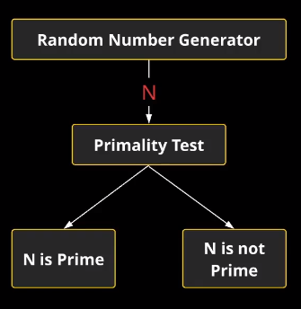
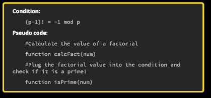
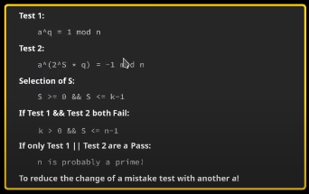

# Prime Numbers
A number that is only divisible by itself and by 1
```
- the bedrock of Cryptography
- density of prime numbers decreases as numbers get bigger
- finding prime numbers is difficult
    - you will be a millionaire if you figure out easier way
- how to figure it out?
    - divide by every number below it or up to it (inefficient)    
```


- to determine if prime, can use a method that :
  - deterministic: definite answer
    - Trial Division
      - expensive
    - Wilson's Theorem
  - probabilistic: 
    - Miller-Rabin
    - does not give a definitive answer (with 100% certainty, but very high)

```
function isPrime(number){
    #check if number == 1
    #check if number == 0
    #check if number is integer
    #check if number is positive

    #divide "number" with numbers in range from 2 to number-1 and check if remainder for any of them is 0

    #if remainder is 0 then it is not prime else it is a prime
}
```


# Primality Tests

## Trial Division
```python
#!/bin/python
import sys

testnumber = int(sys.argv[1])

test = True
for i in range(2, testNumber-1):
    if(testNumber%i == 0):
        test = False
        break

print(test)
```
- tests every number
- expensive

## Wilson's Theorem

```python
def factorial(num):
    factorial = 1
    if(num < 0):
        num = num * (-1)
    elif(num==0):
        return 1
    
    for i in range (1,num+1):
        factorial = factorial*i
    
    return factorial

#Wilson's theorem
#(p-1)! = -1 mod p
def isPrime(num):
    return True if factorial(num-1)%num == -1% num and num!=4 else False

p = int(sys.argv[1])
print("INPUT: %d" % p)
print("(%d-1)! = mod %d" % (p,p))

right = factorial(p-1)%p
left = -1%p

if left == right:
    print("%d == %d" % (left, right))
else:
    print("%d != %d" % (left, right))

print("Is Prime: %r" % isPrime(p))

```
- factorial is expensive like trial division

## Probabilistic Primality Tests
- does not give an answer with 100% certainty, but does give one that is very likely to be true
- used for validating extremely large prime numbers
- runs two tests:
  -  if both tests fail, then the number is not a prime
  - if at least one pass, the number is a prime
 

### Miller-Rabin
- determines if a number is a composite number or probably a prime number
- 2 tests
  - don't need to meet both of them
  - but have to run through both
  - if both fail, then not prime
  - if either pass, then it is prime

```python
#!/bin/python

import sys
import random

n = sys.argv[1]
testNum = sys.argv[2]

def primalityTest(n, testNum):
    if n < 2:
        return False
        if n== 0 or n==1 or n == 4 or n == 6 or n == 8 or n == 9:
            return False
        if n == 2 or n == 3 or n == 5 or n == 7:
            return True
    
    q = n-1
    k = 0
    while q%2 == 0:
        q=q/2
        k+=1
    
    assert(2**k * q == n-1)

    q = int(q)

    print("K: ", k)
    print("Q: ", q)
    print("N: ", n)

    case1 = False
    case2 = False
    for x in range(testNum):
        a = random.randrange(2,n-1)
        if pow(a, q, n) == 1:
            case1 = True
        for i in range(k):
            if pow(a, (pow(2,i) * q), n) == n-1:
                case2 = True

if case1 == True or case2 == True:
    return True

print(primalityTest(int(n), int(testNum)))
```

