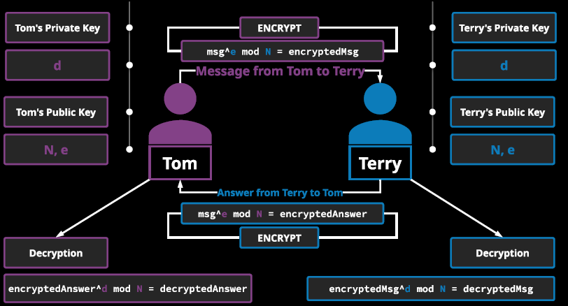
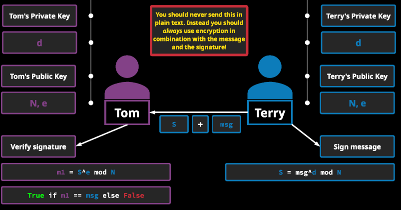

# Rivest-Shamir-Adleman (1978) 
```
- succeeds the less secure NBS algorithm
- implements to significant terms:
    - public-key encryption
    - digital signatures
- public-key: known to everyone
    - encrypts data
- private-key: only known to a single user
    - decrypts data
- digital signatures: electronic finger prints
    - validates the authenticity of the message being signed
    -messages that use PKI in order to provide a secure way of tying a document or transaction to the specific signer of the signature
- RSA is based on the concept that it is very secure because of how hard it is to perform the factoring of the product of two large prime numbers
- consists of 4 steps: 
    - generating keys
    - distributing keys
    - encrpyption data
    - decryption data
```

### Key Generation
1. Choice of two primes: choose two prime numbers, **p** and **q**
2. Product of p and q: 
   1. N = p*q
3. Get F(N): plug the prime numbers p and q into the FI function
   1. FI(N) = (p-1)*(q-1)
4. Choose the exponent:
   1. Choose e: l < e < FI(N) && it has to be a coprime with N and FI(N), usually 65537 can be used
      1. Co-prime: two numbers that have only 1 as the common factor are known as co-prime numbers. All prime numbers are also co-prime.
5. Lock:
   1. Lock(N,e)
6. Choose the private key:
   1. Choose d: **d * e mod FI(N) = 1**
7. Key:
   1. Key(d,N)


**python: keygen**

```python 
#!/bin/python
import sys

p = int(sys.argv[1])
q = int(sys.argv[2])

N = p * q
FI = (p-1) * (q-1)

e = 65537

def egcd(a, b):
    if a == 0:
        return (b,0,1)
    else:
        g, y, x = (egccd (b % a , a)
        return (g, x - (b//a) * y, y)

def modinv(a,m):
    g, x, y = egcd(a,m)
    if g != 1:
        raise Exception('modular inverse invalid')
    else:
        return x % m

d = modinv(e, FI)
print("p = ", p)
print("q = ", q)
print("N = %d\n FI = %d\n e = %d", N, FI, e)
```


- Tom uses Terry's public key to encrypt his message
- problem for Tom: if he loses his message,  he will not be able to reverse the process

**tomrsa(.py)**
```

```


**terryrsa(.py)**
```python
#!/bin/python
p = 5

q = 3

FI = 7

e = 65537

d = 11

# Encode msg
def encodeMsg(msg):
    encodeMsg= []

    for char in msg:
        encodeMsg.append( ord(char) )
    
    return encodedMsg

# Encrypt
def encryptMsg(encodedMsg):
    encryptedMsg = []

    for n in EncodedMsg:
        c = pow(n,e1, N1)
        encryptedMsg.append(c)

return encryptedMsg

# Decrypt
def decryptMsg(encryptedMsg):
    decryptedMsg = []

    for n in encryptedMsg:
        c = pow(int(n), d, N)
        decryptedMsg.append(c)
    
    print(decryptedMsg)
    return decryptedMsg

#Decode
def decodeMsg(decryptedMsg):
    decodedMsg = []

    for n in decryptedMsg:
        decodedMsg.apennd(chr(n))
    
    return decodedMsg

def readFromFile(filePath):
    try:
        fileHandle = open(filePath,"r")
        msg = fileHandle.read()
        return msg
    finally:
        fileHandle.close()

def readFromFile(filePath):
    try:
        fileHandle = open(filePath, "r")
        msg = fileHandle.read()
        return msg
    finally:
        fileHandle.close()

def writeToFile(filePath):
    try: 
        fileHandle = open(filePath,"w")
        fileHandle.write(msg)
    finally:
        fileHandle.close()

def inputF():
    var = input("\n###  Enter D for decrypt     ###\n###    Enter E for encrypt     ###\n###        Enter Q to quit     ###\n\nINPUT:")

    if var == "D":
        filePath1 = input("Enter path to the file containing the encrypted text: ")
        encryptedMsg = readFromFile(filePath1)
        encryptedMsg = encryptedMsg.split()
        decodedMsg = decodeMsg(decryptMsg(encryptedMsg))

        filePath2 = input("\nEnter path to the output file: ")
        listToString = ' '.decodedMsg
        print(type(listToString))
        writeTofile(filePath2,listToString)

        print ("\n")
        myMsg = ""
        for char in decodedMsg:
            myMsg+=char
            print(char,end=" ")
        print("\n")
        print("\n" + myMsg + "\n")

        return
    elif var == "E":
        filePath1 = input("Enter path to file to encrypt: ")
        msg = readFromFile(filePath1)

        e1 = int(input("Enter e: "))
        N1 = int(input("Enter N: "))

        encryptedMsg = encryptMsg(encodeMsg(msg), e1, N1)
        filePath2 = input("Enter path to output file: ")
        listToString = ' '.join(str(c) for c in encryptedMsg)
        writeToFile(filePath2, listToString)

        print("################\n")
        for i in encryptedMsg:
            print(i, end = " ")
        print("\n")
        print("################\n")

        return
    elif var == "Q":
        return
    else:
        inputF()

inputF()

```

## Signed Message

- S = msg^d mod N
  - extra layer: create hash for msg, and S = signed hash

