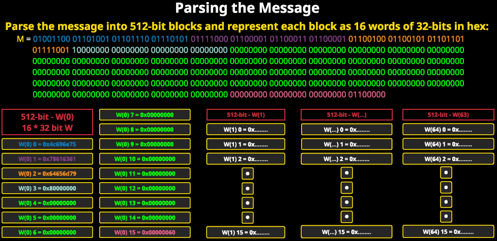

# Secure Hash Algorithm
```
- ceated by the National Institute of Standards and Technology
- provide security by altering data with a cryptographic hash function
- result data is a fixed size that cannot be reversed
    - input is dynamic size, output is fixed
- used for signing digital certificates
- message size: max input size
- block: consists of words that are of a w-bit size
- message digest: size of the output
```

**SHA-0**
- first SHA algorithm
- digest size = 160 bits
- replaced by SHA-1 (also 160 bit output)
- both are no longer used

**SHA-2**
- replaced SHA-1
- standardized for different output sizes: 224, 256, 512, 512/224, 512/256
- most used are SHA-256 and SHA-512
- is a collection of SHA algorithms

    **SHA-256**
    - max message size = 2&64 bits
    - block size = 512 bits
    - word size = 32 bits and message digest of 256bits
    - computed with 32-bits and uses the And, Xor, Rot, Add(mod2^32), Or, and Shr operations for hashing
    - performs 64 rounds
    - a round is an interation of an algorithm

    **SHA-384 and SHA-512**
    - max message size = 2^128 bits
    - block size = 1024 bits
    - word size = 64 bits
    - computed with 64-bits and use the same operations as SHA-256 and SHA-224 except for Add(mod2^64) operation
    - performs 80 rounds

**SHA-2**
- introduced in 2015
- is also standardized for 224, 256, 384, and 512 bit
- based on Keccak algorithm
  - several algorithms were considered, but Keccak was ultimately chosen
- takes an input message of any length and output hashed data of any size needed
- block sizes vary depending on digest size
  - from 576 to 1152 bits
- performs 24 rounds

## Process of SHA algorithms


Pre-processing:
- provide input data to be hashed
- represent every character of the input message as an 8 bit binary 
- add bit 1 to the end of the input message
- pad the message with k zeros
- isnert a 64 bit binary representation of the input message length
- split the new string into a list of 64 bits of 8 bits

**sha256 (.py)**
```python
#!/bin/python

import sys

inputM = sys.argv[1]

print("Msg: ", inputM)

Msg = ""
for c in inputM:
    Msg+= "{0:{fill}8b}".format(ord(c), fill='0')
    print(c, "{0:{fill}8b}".format(ord(c), fill='0'))

l = len(Msg)

Msg+='1'

k = 512 - (l+1) - 64

for i in rnage(0, k):
    Msg += '0'

Msg += "{0:{fill}64b}".format(l, fill='0')

MsgList = []
tmpStr = ""
i = 1
for c in Msg:
    tmpStr += c
    if i%8 == 0:
        MsgList.append(tmpStr)
        tmpStr = ""
    i+= 1

print("\nMsg binary string: ", Msg)
print("\nMsg length before: ", len(inputM))
print("\nMsg length after: ", len(Msg))
print("\nMsg 8 bit list: ", MsgList)
print("\nMsg 8 bit list number of elements: %d\n" % len(MsgList))

for i in MsgList:
    if len(i)%8 != 0:
        print("Problems!!!", end=" ")
    else:
        print(len(i), end= " ")

print("\n\nFormatting DONE!")

K = [ 0x428a2f98, 0x71374491, 0xb5c0fbcf, 0xe9b5dba5,
0x3956c25b, 0x59f111f1, 0x923f82a4, 0xab1c5ed5,
0xd807aa98, 0x12835b01, 0x243185be, 0x550c7dc3,
0x72be5d74, 0x80deb1fe, 0x9bdc06a7, 0xc19bf174,
0xe49b69c1, 0xefbe4786, 0x0fc19dc6, 0x240ca1cc,
0x2de92c6f, 0x4a7484aa, 0x5cb0a9dc, 0x76f988da,
0x983e5152, 0xa831c66d, 0xb00327c8, 0xbf597fc7,
0xc6e00bf3, 0xd5a79147, 0x06ca6351, 0x14292967,
0x27b70a85, 0x2e1b2138, 0x4d2c6dfc, 0x53380d13,
0x650a7354, 0x766a0abb, 0x81c2c92e, 0x92722c85,
0xa2bfe8a1, 0xa81a664b, 0xc24b8b70, 0xc76c51a3,
0xd192e819, 0xd6990624, 0xf40e3585, 0x106aa070,
0x19a4c116, 0x1e376c08, 0x2748774c, 0x34b0bcb5,
0x391c0cb3, 0x4ed8aa4a, 0x5b9cca4f, 0x682e6ff3,
0x748f82ee, 0x78a5636f, 0x84c87814, 0x8cc70208,
0x90befffa, 0xa4506ceb, 0xbef9a3f7, 0xc67178f2]

H = [0x6a09e667, 0xbb67ae85, 0x3c6ef372, 0xa54ff53a, 0x510e527f, 0x9b05688c, 0x1f83d9ab, 0x5be0cd19 ] 

for i in range(len(H)):
    H[i] = '{0:{fill}32b}'.format(int(hex(H[i]),16), fill='0')

for i in range(len(K)):
    K[i] = '{0:{fill}32b}'.format(int(hex(K[i]),16), fill='0')

def AND(X,Y):
    return '{0:{fill}32b}'.format((int(x,2) & int(y,2)) , fill = '0')

#XOR
# x ^ y
def XOR(x, y):
    return '{0:{fill}32b}'.format((int(x,2)^int(y,2)), fill = '0')

#AND
# x & y
def AND(x, y):
    return '{0:{fill}32b}'.format((int(x,2) & int(y,2)), fill = '0')

#NOT
#~x
def NOT(X):
    not_x = ""
    for i in range(len(x)):
        if x[i] == '0':
            not_x += '1'
        else:
            not_x += '0'
    return not_x

# OR 
# x|y
def OR(x,y):
    return '{0:{fill}32b}'.format((int(x,2) | int(y,2)), fill = '0')

# - Ch
# (x & y) ^ (~x & z)
def Choice(x,y,z):
    return XOR(AND(x,y), AND(NOT(x), z))
    
# - Maj
# ((x & y) ^ (x & z)) ^ (y & z)
def Majority(x,y,z):
    return XOR(AND(x,y),AND(x,z),AND(y,z))


#shift
def R_S(x, n):
    z = '0' * n
    #print("X in R_S: ", x)
    x = z + x
    if len(x) > 32:
        return x[:-(len(x)-32)]
    else:
        return x

def L_S(x, n):
    z = '0' * n
    x = x + z
    if len(x)>32:
        return x[len(x):-32:]
    else:
        return x

# ROTR
# ( x >>> n) | (x << (32-n))
def ROTR(x, n):
    return OR((R_S(x,n)), L_S(x,32-n))

# Sum0
# 2,13,22 are just properties of SHA. following values in other functions are properties of their respective function (chosen for the algorithm)
def Sum0(x):
    a = ROTR(x, 2)
    b = ROTR(x, 13)
    c = ROTR(x, 22)
    return XOR(XOR(a,b), C)

# Sum1
def Sum1(x):
    a = ROTR(x, 6)
    b = ROTR(x, 11)
    c = ROTR(x, 25)
    return XOR(XOR(a,b), c)

    
#Sigma0(var)
def Sigma0(x):
    a = ROTR(x, 7)
    b = RO TR(x, 18)
    c = R_S(x, 3)
    return XOR(XOR(a,b), c)

#Sigma1(var)
def Sigma1(x):
    a = ROTR(x, 17)
    b = ROTR(x, 19)
    c = R_S(x, 10)
    return XOR(XOR(a,b), c)

def mod32add(x):
    v = 0
    for i in range(len(x)):
        v+= int(x[i], 2)
    ret = v % pow(2,32)
    return '{0:{fill}32b}'.format(int(bin(ret),2), fill='0')

# Main Loop:

# N iterations but we only have so we do not really need a loop here if oru M was bigger then we would need to go up to the nubmer N of 512 bit chunks

#working variables:
a = H[0]
b = H[1]
c = H[2]
d = H[3]
e = H[4]
f = H[5]
g = H[6]
h = H[7]

# 16 word Block 0
M = [[]]
#for loop: for(int i =0; i<len(MsgList); i=i+4)
for s in range(0,len(MsgList,4):
    M[0].append(MsgList[s] + MsgList[s+1] + MsgList[s+2] + MsgList[s+3])

W = [None] * 64

for t in range(0, 16):
        W[t] = M[0][t]

for t in range(16, 64):
    W[t] = mod32Add([Sigma1(W[t-2]), W[t-7], Sigma0(W[t-15]), W[t-16]])

for t in range(64):
    T1 = mod32Add([h, Sum1(e), Choice(e,f,g), K[t], W[t]])
    T2 = mod32Add([Sum0(a), Majority(a,b,c)])
    h = g
    g = f
    f = e
     e = mod32Add([d, T1])
    d = c
    c = b
    a = mod32Add([T1,T2])

H[0] = mod32Add([H[0],a])
H[1] = mod32Add([H[1],b])
H[2] = mod32Add([H[2],c])
H[3] = mod32Add([H[3],d])
H[4] = mod32Add([H[4],e])
H[5] = mod32Add([H[5],f])
H[6] = mod32Add([H[6],g])
H[7] = mod32Add([H[7],h])

FinalHashBin = H[0] + H[1] + H[2] + H[3] + H[4] + H[5] + H[6] + H[7]

import hashlib

refHash = "0x" + hashlib.sha256(b"Linuxacademy").hexdigest().upper()
FinalHashHex = '0x{0:08X}'.format(int(FinalHashBin,2))

#compare:
#refHash==finalHashHex?0:1

```


## Padding Message example:

**Convert the message M to binary number system and get length l:**

Convert "M = Linuxacademy" to 8 bit binary represnetation
L = 01001100
i = 01101001
...
y = 01111001

**Add 1 bit to the end of the message M:**

M = 01001100 01101001 01101110 01110101 01111000 01100001 01100011 01100001 01100100 01100101 01101101 01111001 + 1 bit

Length = l = 96 bits

**Append the message M with k zero bits so that it is a multiple of 512 and add a 64-bit representation of length l to the end:**

Calculate the number of 0 bits to append:

512 - (l+1) - 64 = k

Convert l to a 64 bit representation:

M = 01001100 01101001 01101110 01110101 01111000 01100001 01100011 01100001 01100100 01100101 01101101 01111001 + 1 bit + (k zero bits) + l as 64-bit bin

newLength = l + 1 + {k zero bits} + 64 bit l = 512


## Parsing The Message

```
blocks are 512 bits (16 * 32 bits)
```


- K: constants provided with 256
  - representations of the first 64 bits of the of the fractional parts of the cube roots
  - first 80 prime numbers represented in hexadecimal
- red: initial hash values (provided)
- yellow and red are provided
- blue determined by preprocessing
- working variables: initial values will be the provided hash values but will soon be shuffled
- 


