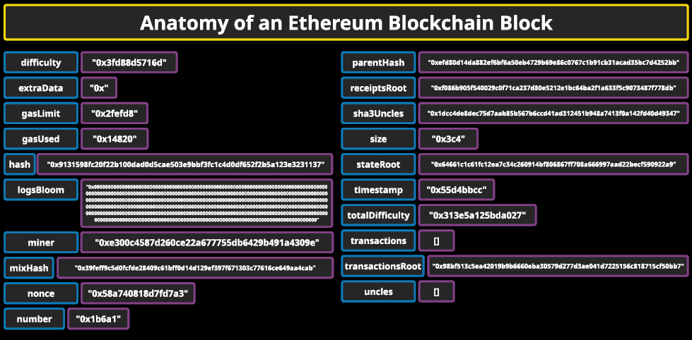

# Ethereum
```
- not only for monetary transactions (making payments, recceiving payments, sending or receiving assets), but also for creating smart contracts
- smart contracts facilitate many kinds of functionality
    - contracts that have automatically react to the state of the contract
    - written in solidity
- referred to as a 2nd generation blockchain
- another aspect of ethereum: Ethereum Virtual Machine (EVM)
    - a decentralized virtual machine that all nodes of the Ethereum blockchain run but it runs separate from the main Ethereum network
    - very useful for testing smart contracts, testing if communications are secure, preventing DoS attacks, enabling high fault tolerance, and more
    - makes computing slower
    - also stores current state of every smart contract on the blockcian
- started off as PoW but transitioning to PoS
- has more differences than similarities with Bitcoin
- Bitcoin: decentralized payment system
- Ethereum: decentralized super computer than executes smart contracts
- Ethereum users are required to create two kinds of accounts
    - Eternally owned account (EOA): controlled by private keys to make and trigger smart contractions
    - Contract account: controlled by code t hat is programmed into them when they are created
        - controlled by code with predefined triggers
- block    
    - break up block into all of its components
        - block size
        - block header
        - transaction counter
        - transaction: can break a transaction into all of its components
```

